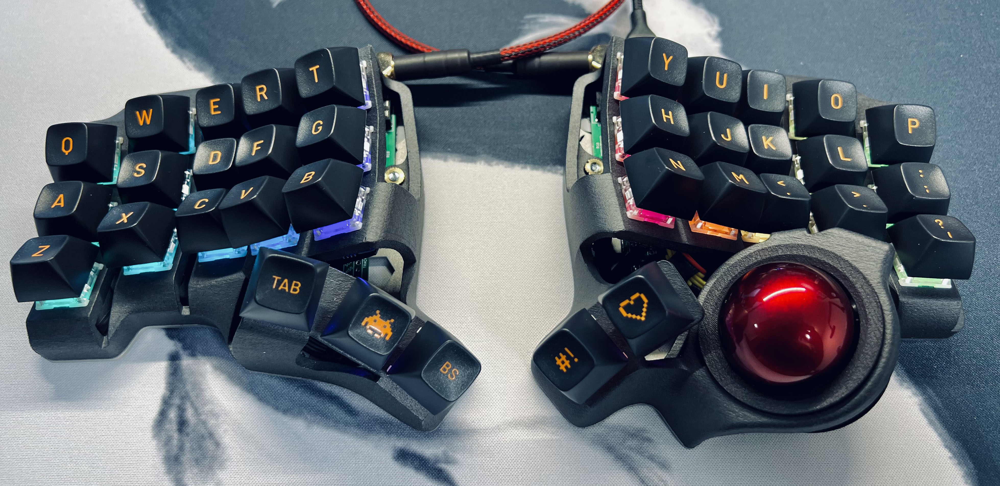

# Keyboards

## English

This repository contains keyboard-related projects focused on visualization, typing training, and BastardKB Charybdis in particular.

Projects included here:

- `visualizer` — a QMK keyboard visualizer with layer display, layout tracking, tutor mode, and Charybdis-focused tooling
- `keyboard-labeler` — a tool for segmenting keyboard photos, recognizing legends/icons, and preparing keyboard data
- `field_sim` / HID lighting tools — utilities for working with physical keyboard LEDs and Charybdis lighting workflows

The repository also includes typing-training functionality, including tutor lessons and multi-course support.

Most of this work was built with AI assistance and then adapted, tested, and refined for my own workflow.

## Русский

В этом репозитории лежат проекты, связанные с клавиатурами: визуализация клавиатуры, обучение набору и инструменты именно для BastardKB Charybdis.

Что входит в репозиторий:

- `visualizer` — визуализатор QMK-клавиатуры с отображением слоёв, отслеживанием раскладки, режимом тренажёра и функциональностью под Charybdis
- `keyboard-labeler` — инструмент для сегментации фотографий клавиатуры, распознавания легенд и пиктограмм и подготовки данных по клавишам
- `field_sim` / HID lighting tools — утилиты для работы с физической подсветкой клавиатуры и сценариями RGB/LED для Charybdis

Здесь также есть функциональность для обучения набору текста: уроки, тренажёр и поддержка нескольких курсов.

Большая часть этой работы делалась с помощью ИИ, а затем дорабатывалась, проверялась и подгонялась под реальный сценарий использования.
